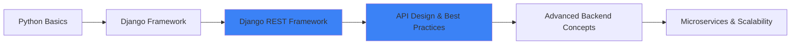

<div align="center">

# 👨‍💻 Sina | Backend Developer


[](mailto:sinatpa1717@gmail.com)
[](https://instagram.com/sina.tpa)
[](https://github.com/sinatpa1717)

</div>

---

## 🎯 About Me

```python
class BackendDeveloper:
    def __init__(self):
        self.name = "Sina"
        self.role = "Backend Developer"
        self.language_spoken = ["fa_IR", "en_US"]
        self.main_focus = "Django REST Framework"
        
    def current_goal(self):
        return "Building scalable backend systems and APIs"
    
    def say_hi(self):
        print("Thanks for visiting! Let's build something amazing together!")

me = BackendDeveloper()
me.say_hi()
```

⚡ **Passionate about building robust backend systems with Django**  
🔍 **Currently mastering Django REST Framework and API design**  
🚀 **Learning new technologies and best practices every day**

---

## 🛠️ Tech Stack

<div align="center">

### Languages & Frameworks


### Tools & Technologies


</div>

---

## 📂 Featured Projects

<div align="center">

<table>
<tr>
<td width="50%">

### 🗂️ File Manager
[](https://github.com/sinatpa1717/file-Manager-.git)

A file management system built with Django

**Tech Stack:**
- Python
- Django
- File Operations

</td>
<td width="50%">

### 🔌 Django REST Framework Sample
[](https://github.com/sinatpa1717/-Django-REST-Framework-.git)

RESTful API implementation using DRF

**Tech Stack:**
- Django REST Framework
- API Design
- Authentication

</td>
</tr>
</table>

</div>

---

## 📊 GitHub Statistics

<div align="center">


</div>

---

## 🎯 Current Learning Path



---

## 🌟 Goals for 2025

- ✅ Master Django REST Framework
- 🔄 Build production-ready APIs
- 🔄 Learn containerization with Docker
- 🔄 Contribute to open-source projects
- 🔄 Build a complete SaaS application

---

<div align="center">

### 💡 "Code is like humor. When you have to explain it, it's bad." – Cory House


**⭐ Don't forget to star my repositories if you find them useful!**

</div>
